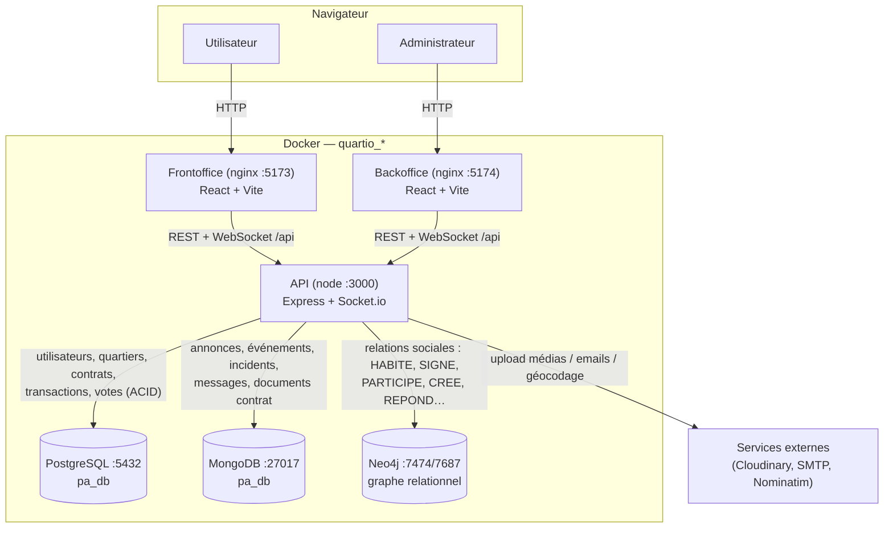
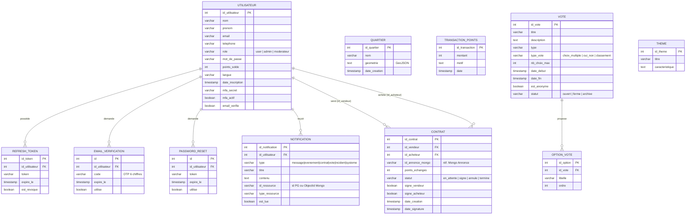
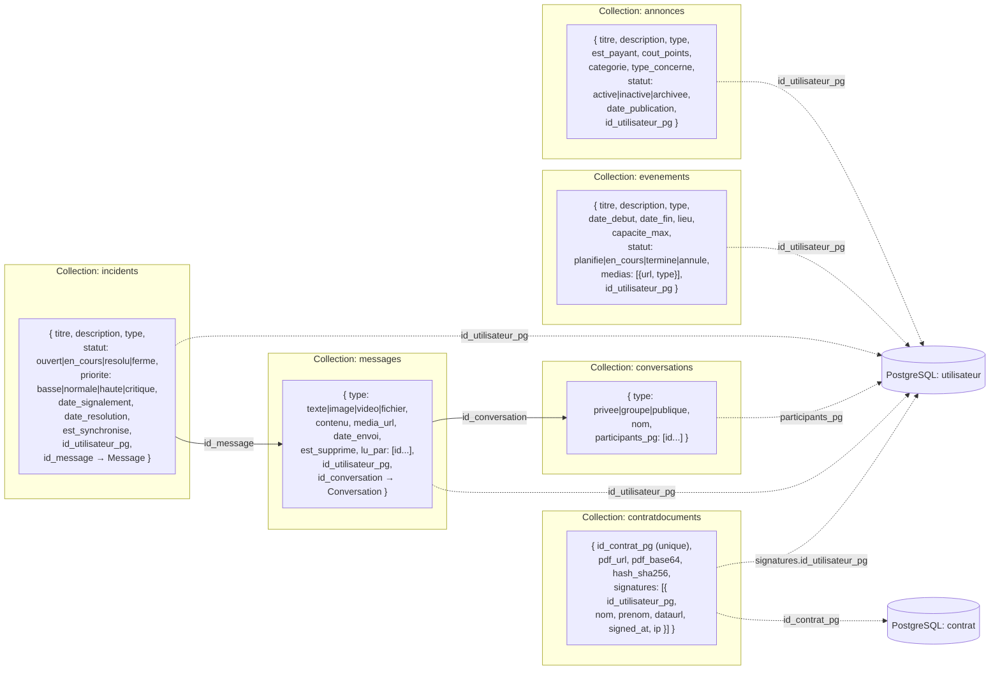
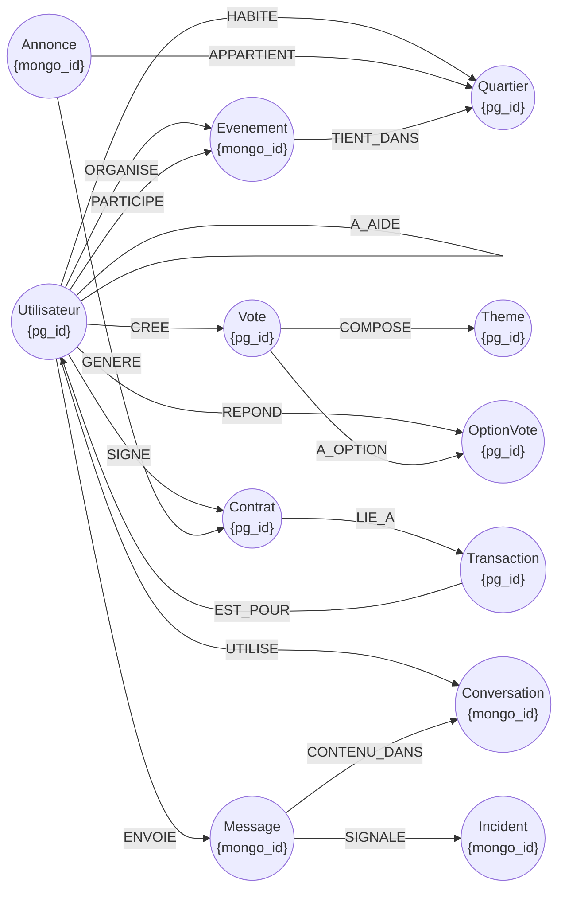
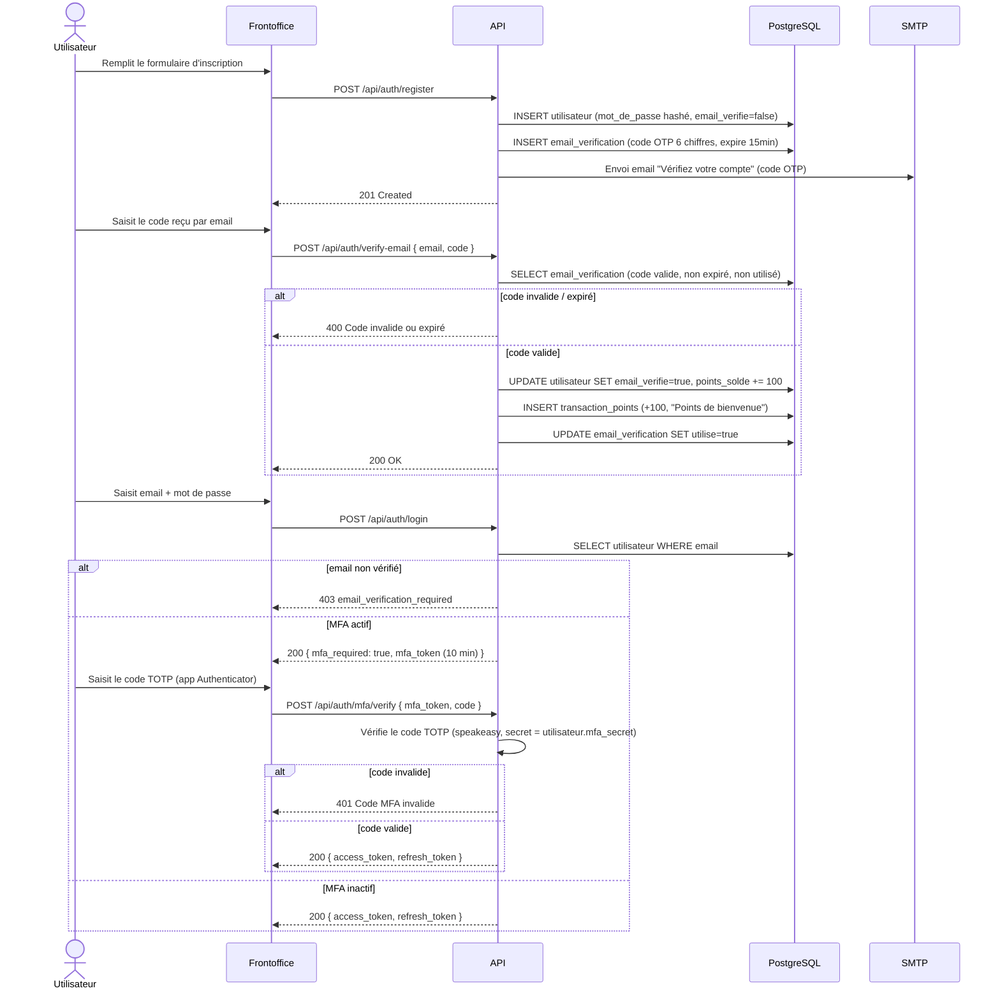
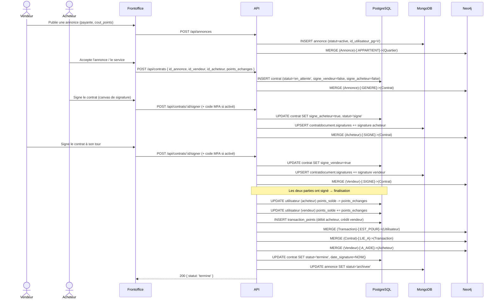

# Architecture — Quartio

Ce document regroupe les schémas d'architecture et diagrammes de séquence du projet
(BLOC 16.1). Les diagrammes sont au format [Mermaid](https://mermaid.js.org/), affichés
nativement par GitHub/GitLab.

---

## 1. Architecture globale (conteneurs Docker, flux de données)

| Service | Rôle | Port exposé |
|---|---|---|
| `frontoffice` | App React utilisateurs (build statique servi par nginx) | 5173 |
| `backoffice` | App React admin (build statique servi par nginx) | 5174 |
| `api` | API REST + Socket.io (Express, Node 20) | 3000 |
| `db` | PostgreSQL 16 — données transactionnelles (ACID) | 5432 |
| `mongo` | MongoDB 7 — documents riches (annonces, messages…) | 27017 |
| `neo4j` | Neo4j 5 — graphe des relations entre entités | 7474 / 7687 |

Chaque image est buildée de façon statique (pas de bind-mount du code source) : toute
modification de `api-rest-pa/src`, `Frontoffice/src` ou `Backoffice/src` nécessite
`docker compose build <service> && docker compose up -d <service>`.

---

## 2. Schéma de la base PostgreSQL (entités, relations)

PostgreSQL porte les données nécessitant des garanties **ACID** : comptes utilisateurs,
authentification, contrats, transactions de points et votes.

> Les liens `quartier ↔ utilisateur/annonce/événement`, `vote ↔ theme/utilisateur`,
> `transaction_points ↔ utilisateur/contrat` ne sont **pas** des clés étrangères
> PostgreSQL : ils sont matérialisés dans **Neo4j** (voir section 4) pour permettre des
> requêtes de graphe (ex. "quels voisins ont aidé tel utilisateur ?").

---

## 3. Schéma MongoDB (collections, documents types)

MongoDB porte les **documents riches et semi-structurés** : annonces, événements,
incidents, conversations/messages et l'archive des contrats signés. Chaque document
référence son auteur PostgreSQL via `id_utilisateur_pg`.

Toutes les collections incluent `createdAt`/`updatedAt` (option `timestamps: true` de
Mongoose). Les liens en pointillés (`-.->`) sont des références applicatives vers
PostgreSQL (pas de contrainte au niveau base).

---

## 4. Schéma Neo4j (nœuds, relations, propriétés)

Neo4j matérialise les **relations** entre entités gérées par PostgreSQL et MongoDB —
chaque nœud porte uniquement un identifiant de référence (`pg_id` ou `mongo_id`), les
données métier restant dans leur base d'origine.

| Relation | De → Vers | Signification |
|---|---|---|
| `HABITE` | Utilisateur → Quartier | rattachement géographique (détection par adresse / ray casting) |
| `A_AIDE` | Utilisateur — Utilisateur | un voisin a rendu un service à un autre (créé à la finalisation d'un contrat de service) |
| `CREE` | Utilisateur → Vote | auteur d'un vote |
| `REPOND` | Utilisateur → OptionVote | vote exprimé (propriété `date_vote`) |
| `ORGANISE` | Utilisateur → Evenement | organisateur d'un événement |
| `PARTICIPE` | Utilisateur → Evenement | inscription à un événement |
| `SIGNE` | Utilisateur → Contrat | signature acheteur/vendeur |
| `ENVOIE` | Utilisateur → Message | auteur d'un message |
| `UTILISE` | Utilisateur → Conversation | participant à une conversation |
| `APPARTIENT` | Annonce → Quartier | quartier de rattachement de l'annonce |
| `GENERE` | Annonce → Contrat | contrat créé depuis une annonce |
| `TIENT_DANS` | Evenement → Quartier | quartier où se déroule l'événement |
| `COMPOSE` | Vote → Theme | thème associé au vote |
| `A_OPTION` | Vote → OptionVote | options proposées par le vote |
| `CONTENU_DANS` | Message → Conversation | rattachement du message à la conversation |
| `SIGNALE` | Message → Incident | message à l'origine du signalement d'incident |
| `LIE_A` | Contrat → Transaction | transactions de points générées par le contrat |
| `EST_POUR` | Transaction → Utilisateur | bénéficiaire/débiteur de la transaction |

---

## 5. Diagramme de séquence — Inscription + vérification email + MFA

---

## 6. Diagramme de séquence — Flux contrat complet (annonce → contrat → signature → finalisation)

